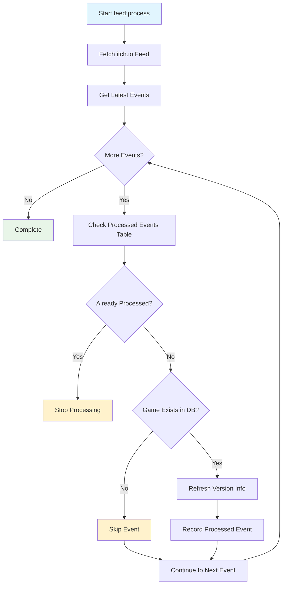

# feed:process

Processes the itch.io feed to discover and update game information automatically.

## Overview

This command monitors the itch.io public feed for game updates and processes new events to keep the database
synchronized with the latest game information. It includes built-in duplicate detection and retry logic for robust
operation.

**Key Features**: Automatic discovery, duplicate prevention, rate limit handling, comprehensive logging.

## Usage

```bash
php artisan feed:process
```

## Options

This command has no specific options - it processes the feed automatically using configured settings.

## Processing Logic

The command follows this workflow:

1. **Fetches latest feed events** from itch.io's public feed
2. **Checks processed events table** to avoid duplicate processing
3. **Stops at first already-processed event** to prevent reprocessing
4. **Processes new events** in chronological order
5. **Updates game information** based on event data
6. **Records processed events** to prevent future duplicates

## Examples

<tabs>
<tab title="Standard Processing">
<code-block lang="bash">
php artisan feed:process
</code-block>
<p>Processes all new events from the itch.io feed since the last run.</p>
</tab>
<tab title="Verbose Output">
<code-block lang="bash">
php artisan feed:process -v
</code-block>
<p>Shows detailed processing information including event details and API calls.</p>
</tab>
<tab title="Quiet Mode">
<code-block lang="bash">
php artisan feed:process --quiet
</code-block>
<p>Only shows errors, useful for automated/scheduled execution.</p>
</tab>
</tabs>

## When to Use

<procedure title="Recommended Usage Scenarios">
<step>Scheduled automatic execution (recommended: every 15-30 minutes)</step>
<step>Manual execution after extended downtime</step>
<step>Testing feed processing after configuration changes</step>
<step>Recovering from failed automated runs</step>
</procedure>

## Processing Behavior

The feed processor treats all events uniformly - it doesn't differentiate between event types. For every feed event:

<table>
<tr>
    <td>Condition</td>
    <td>Action Taken</td>
    <td>Data Updated</td>
</tr>
<tr>
    <td>Game exists in database</td>
    <td>Refresh version information</td>
    <td>Version details, download links, platform support</td>
</tr>
<tr>
    <td>Game not in database</td>
    <td>Skip event</td>
    <td>None</td>
</tr>
</table>

## Error Handling

The command includes comprehensive error handling:

- **Rate Limiting**: Automatic retry with exponential backoff
- **API Failures**: Retry logic for temporary network issues
- **Duplicate Detection**: Prevents reprocessing of already-handled events
- **Data Validation**: Ensures feed data integrity before processing

## Monitoring

Monitor the following during feed processing:

- **Events processed count** - Should match expected feed activity
- **API rate limit status** - Watch for 429 responses
- **Processing time** - Longer times may indicate API issues
- **Error rates** - High error rates suggest configuration problems

> **Note**: Feed processing is designed to be idempotent - running it multiple times will not create duplicate data due to the processed events tracking system.

## Processing Flow

This diagram shows the detailed flow of feed processing:



## Related Commands

- [games:refresh](games-refresh.md) - Manual game information refresh
- [games:refresh-feedless](games-refresh-feedless.md) - Update games not in feed
