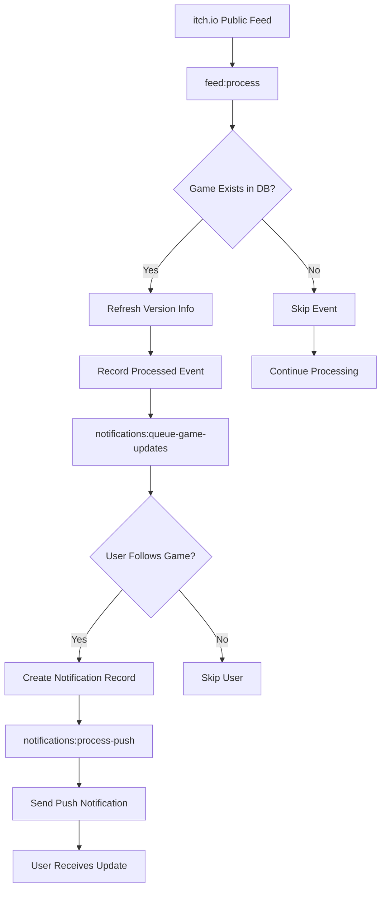
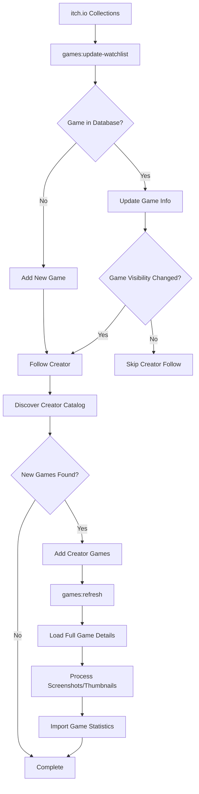
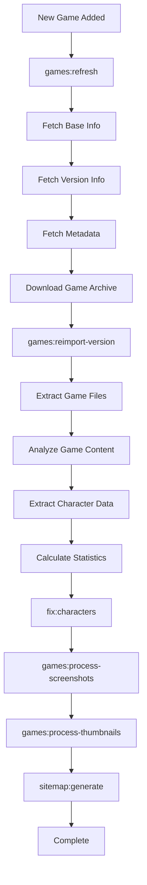
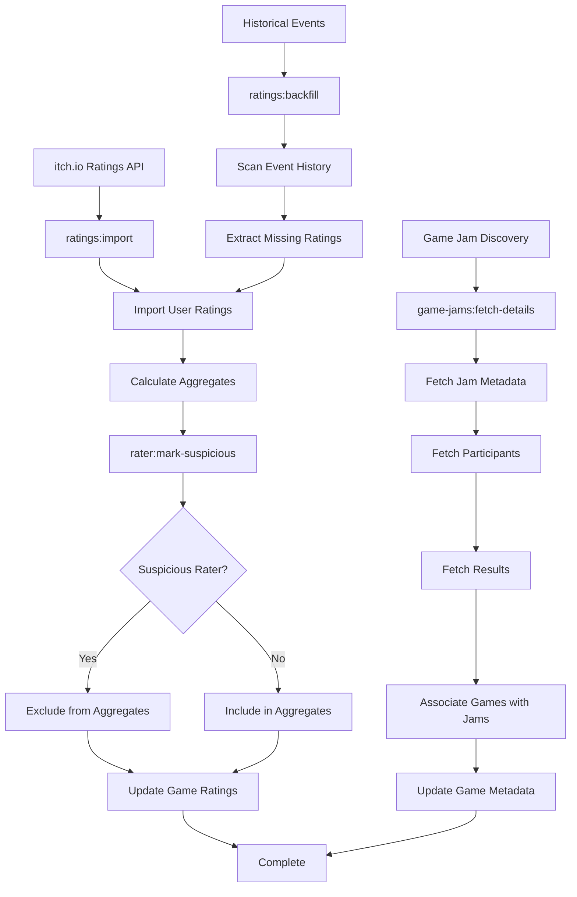
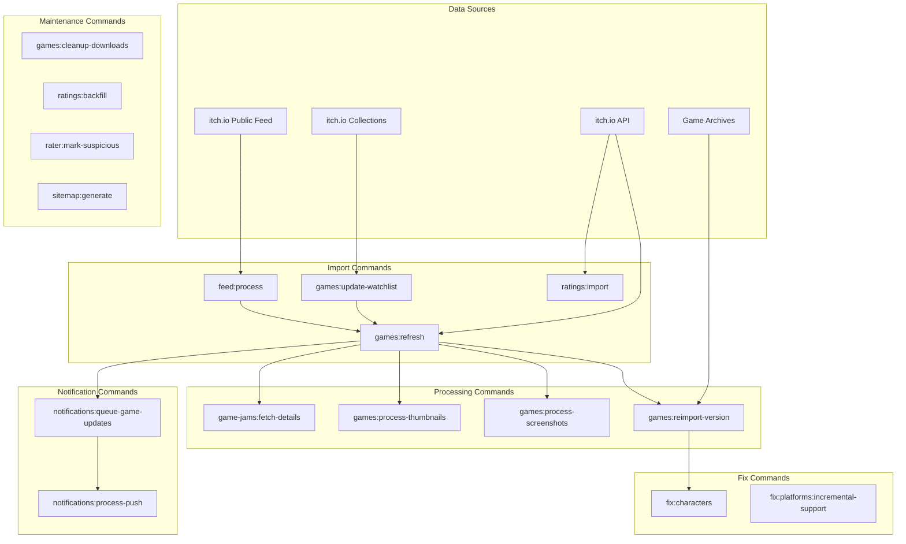

# Commands Overview

This section provides comprehensive documentation for all artisan commands available in the FVN.li project.

## Command Categories

### Fix Commands

Data repair and maintenance commands for ensuring database consistency.

| Command                             | Purpose                            | Key Options                                                   |
|-------------------------------------|------------------------------------|---------------------------------------------------------------|
| `fix:characters`                    | Comprehensive character data fixes | `--dry-run`, `--game-id=ID`, `--version-id=ID`, `--step=STEP` |
| `fix:platforms:incremental-support` | Report platform support issues     | `--game-id=ID` (report only)                                  |

### Feed Commands

Processing of the itch.io feed for automatic game discovery and updates.

| Command        | Purpose                               |
|----------------|---------------------------------------|
| `feed:process` | Process itch.io feed for game updates |

### Game Jam Commands

Management and enrichment of game jam information.

| Command                   | Purpose                                | Key Options                                    |
|---------------------------|----------------------------------------|------------------------------------------------|
| `game-jams:fetch-details` | Fetch additional details for game jams | `--all`, `--id=ID`, `--name=NAME`, `--url=URL` |

### Games Commands

Comprehensive game data management, media processing, and information updates.

| Command                     | Purpose                               | Key Options                                            |
|-----------------------------|---------------------------------------|--------------------------------------------------------|
| `games:cleanup-downloads`   | Clean up old game version downloads   | `--game-id=ID`, `--all`                                |
| `games:import-stats`        | Import stats JSON for a game version  | `--game-id=ID`, `--version-id=ID`, `--stats-file=PATH` |
| `games:process-screenshots` | Process and optimize game screenshots | `--game-id=ID`, `--all`, `--quality=N`                 |
| `games:process-thumbnails`  | Process and optimize game thumbnails  | `--game-id=ID`, `--all`, `--quality=N`                 |
| `games:refresh`             | Refresh game information from itch.io | `--game-id=ID`, `--all`, `--update-*`                  |
| `games:refresh-feedless`    | Refresh feedless games                | Various filtering options                              |
| `games:reimport-version`    | Reimport version statistics           | Version targeting options                              |
| `games:update-watchlist`    | Update games from watchlist           | Collection management options                          |

### Notification Commands

User notification processing and delivery system.

| Command                            | Purpose                                    | Key Options                     |
|------------------------------------|--------------------------------------------|---------------------------------|
| `notifications:process-push`       | Process pending browser push notifications | `--limit=COUNT`, `--batch=SIZE` |
| `notifications:queue-game-updates` | Queue notifications for game updates       | `--days=N`, `--limit=COUNT`     |

### Rater Commands

User rating behavior management and moderation tools.

| Command                 | Purpose                              | Key Options                 |
|-------------------------|--------------------------------------|-----------------------------|
| `rater:mark-suspicious` | Mark or unmark a rater as suspicious | `--reason=TEXT`, `--unmark` |

### Ratings Commands

Import and management of game ratings data from itch.io.

| Command            | Purpose                                     | Key Options             |
|--------------------|---------------------------------------------|-------------------------|
| `ratings:backfill` | Backfill missing ratings by scanning events | `--batch-size=SIZE`     |
| `ratings:import`   | Import latest ratings from itch.io          | None (automatic import) |

### Sitemap Commands

SEO optimization through XML sitemap generation.

| Command            | Purpose                       |
|--------------------|-------------------------------|
| `sitemap:generate` | Generate the sitemap.xml file |

## General Usage Guidelines

### Getting Help

Use `php artisan COMMAND --help` for detailed help on any specific command.

### Common Patterns

- **Dry Run**: Many commands support `--dry-run` to preview changes
- **Targeting**: Most commands support `--game-id=ID` for specific games
- **Batch Processing**: Commands often include `--limit` options for batch control
- **Verbose Output**: Use `-v` for detailed execution information

### Performance Considerations

- **Resource Usage**: Media processing and bulk operations can be resource-intensive
- **API Limits**: Commands that interact with itch.io respect rate limiting
- **Batch Sizes**: Adjust batch sizes based on system resources and requirements
- **Scheduling**: Many commands are designed for automated/scheduled execution

### Error Handling

All commands include comprehensive error handling with retry logic for temporary failures and detailed logging for
troubleshooting.

## Data Flow Diagrams

### Game Update Processing Flow

This diagram shows how game updates flow from itch.io through the system to user notifications:

### Watchlist and Creator Discovery Flow

This diagram shows how new games are discovered through watchlists and creator following:

### Game Data Processing Pipeline

This diagram shows the complete game data processing pipeline from import to analysis:

### Ratings and Game Jam Data Flow

This diagram shows how ratings and game jam information are processed:

### System Architecture Overview

This diagram shows the overall command architecture and how different command categories interact:

