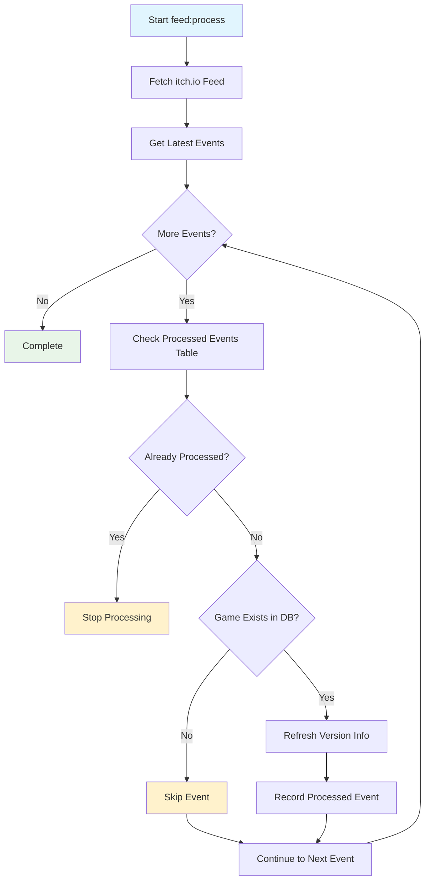

# feed:process

Processes the itch.io feed to discover and update game information automatically.

## Overview

This command monitors the itch.io public feed for game updates and processes new events to keep the database
synchronized with the latest game information. It includes built-in duplicate detection and retry logic for robust
operation.

## Usage

```bash
php artisan feed:process
```

## Options

This command has no specific options - it processes the feed automatically using configured settings.

## Processing Logic

The command follows this workflow:

1. **Fetches latest feed events** from itch.io's public feed
2. **Checks processed events table** to avoid duplicate processing
3. **Stops at first already-processed event** to prevent reprocessing
4. **Processes new events** in chronological order
5. **Updates game information** based on event data
6. **Records processed events** to prevent future duplicates

## Examples

=== "Standard Processing"

    ```bash
    php artisan feed:process
    ```
    <p>Processes all new events from the itch.io feed since the last run.</p>

=== "Verbose Output"

    ```bash
    php artisan feed:process -v
    ```
    <p>Shows detailed processing information including event details and API calls.</p>

=== "Quiet Mode"

    ```bash
    php artisan feed:process --quiet
    ```
    <p>Only shows errors, useful for automated/scheduled execution.</p>

## When to Use

**Recommended Usage Scenarios**

1. Scheduled automatic execution (recommended: every 15-30 minutes)
2. Manual execution after extended downtime
3. Testing feed processing after configuration changes
4. Recovering from failed automated runs

## Processing Behavior

The feed processor treats all events uniformly - it doesn't differentiate between event types. For every feed event:

<table>
<tr>
    <td>Condition</td>
    <td>Action Taken</td>
    <td>Data Updated</td>
</tr>
<tr>
    <td>Game exists in database</td>
    <td>Refresh version information</td>
    <td>Version details, download links, platform support</td>
</tr>
<tr>
    <td>Game not in database</td>
    <td>Skip event</td>
    <td>None</td>
</tr>
</table>

## Processing Flow

This diagram shows the detailed flow of feed processing:



## Related Commands

- [games:refresh](games-refresh.md) - Manual game information refresh
- [games:refresh-feedless](games-refresh-feedless.md) - Update games not in feed
